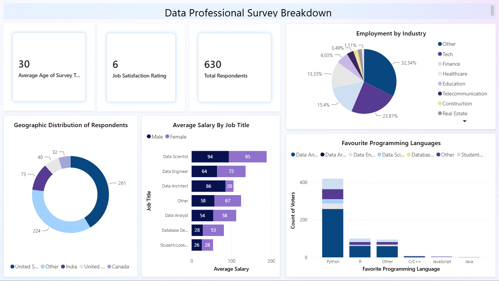

# Data Professional Survey Breakdown (Power BI)

## Project Overview
An interactive Power BI dashboard designed to analyze global survey data from 630 data professionals. This project covers the entire data analytics workflow: from data ingestion and comprehensive ETL (Extract, Transform, Load) cleaning in Power Query to final interactive dashboard design.

## Data Transformation & Cleaning (Power Query)
Before building the visuals, the raw survey dataset was processed and cleaned to ensure data integrity:
- **Anomalies & Rows Removal:** Filtered out irrelevant, incomplete, and empty rows (such as removing invalid product/milk entries and subtotals from the raw data structure).
- **Data Type Optimization:** Adjusted and standardized data types for dates, text, and numerical values to ensure accurate aggregations.
- **Calculated Metrics & Measures:** Created custom calculated metrics to enable deeper analysis, including preparing the dataset for key metrics like Average Salary, Average Age, and Job Satisfaction Ratings.

## Dashboard Design & Visualizations
The dashboard was engineered with a clear visual hierarchy using specific chart types for different business questions:
- **KPI Cards:** Applied to highlight high-level metrics at a glance (**Total Respondents**, **Average Age**, and **Job Satisfaction Rating**).
- **Stacked Bar Charts:** Utilized for **Average Salary by Job Title**, broken down by gender, allowing easy comparison across long-text job roles.
- **Pie & Donut Charts:** Implemented for **Employment by Industry** and **Geographic Distribution** to clearly display percentage and parts-of-a-whole distributions.
- **Stacked Column Charts:** Used to rank and compare **Favorite Programming Languages** among voters (highlighting Python's dominance).

## Tech Stack Used
- **Power BI Desktop**
- **Power Query Editor** (ETL process)
- **DAX** (Data Analysis Expressions for calculated metrics)

## Dashboard Preview
 

## How to Run the Project
1. Clone this repository to your local machine.
2. Ensure you have **Power BI Desktop** installed.
3. Open the `.pbix` project file to interact with the dynamic filters and explore the insights.
